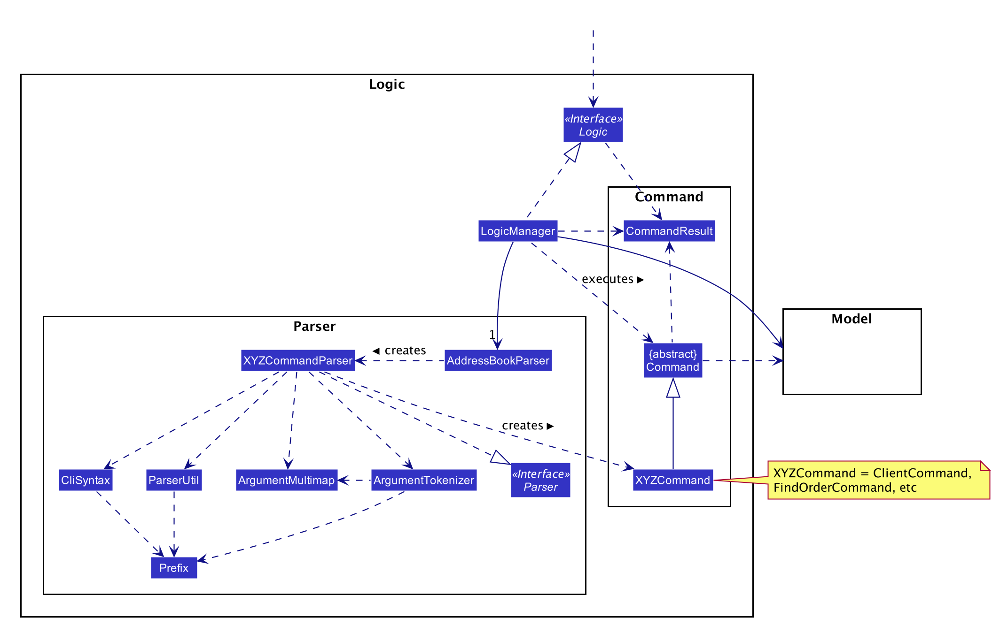
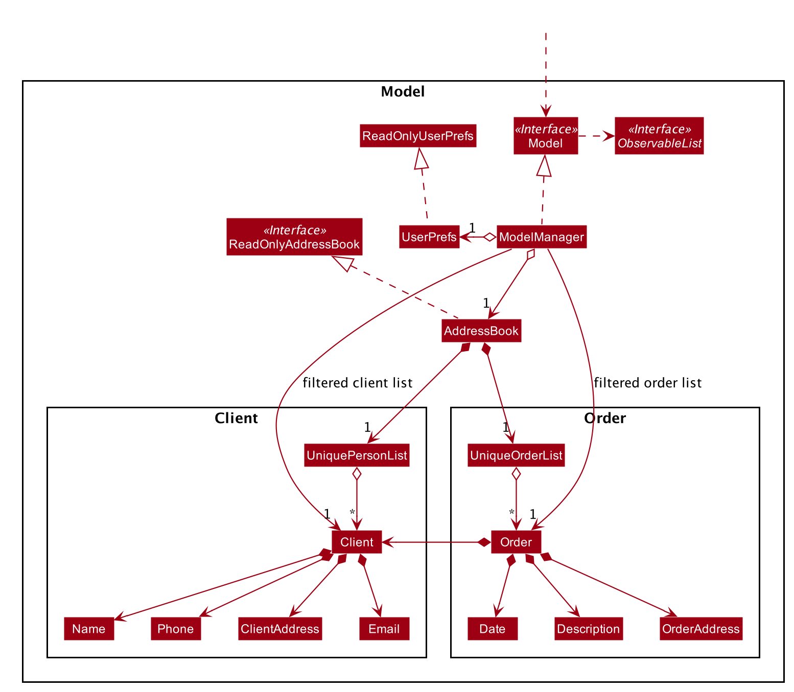

* Table of Contents
{:toc}

--------------------------------------------------------------------------------------------------------------------

## **Setting up, getting started**

Refer to the guide [_Setting up and getting started_](SettingUp.md).

--------------------------------------------------------------------------------------------------------------------

## **Design**

### Architecture

The ***Architecture Diagram*** given above explains the high-level design of the App. Given below is a quick overview of each component.

:bulb: **Tip:** The `.puml` files used to create diagrams in this document can be found in the [diagrams](https://github.com/se-edu/addressbook-level3/tree/master/docs/diagrams/) folder. Refer to the [_PlantUML Tutorial_ at se-edu/guides](https://se-education.org/guides/tutorials/plantUml.html) to learn how to create and edit diagrams.

**`Main`** has two classes called [`Main`](https://github.com/se-edu/addressbook-level3/tree/master/src/main/java/seedu/address/Main.java) and [`MainApp`](https://github.com/se-edu/addressbook-level3/tree/master/src/main/java/seedu/address/MainApp.java). It is responsible for,
* At app launch: Initializes the components in the correct sequence, and connects them up with each other.
* At shut down: Shuts down the components and invokes cleanup methods where necessary.

[**`Commons`**](#common-classes) represents a collection of classes used by multiple other components.

The rest of the App consists of four components.

* [**`UI`**](#ui-component): The UI of the App.
* [**`Logic`**](#logic-component): The command executor.
* [**`Model`**](#model-component): Holds the data of the App in memory.
* [**`Storage`**](#storage-component): Reads data from, and writes data to, the hard disk.

Each of the four components,

* defines its *API* in an `interface` with the same name as the Component.
* exposes its functionality using a concrete `{Component Name}Manager` class (which implements the corresponding API `interface` mentioned in the previous point.

For example, the `Logic` component (see the class diagram given below) defines its API in the `Logic.java` interface and exposes its functionality using the `LogicManager.java` class which implements the `Logic` interface.

**How the architecture components interact with each other**

The *Sequence Diagram* below shows how the components interact with each other for the scenario where the user issues the command `delete 1`.

The sections below give more details of each component.

### UI component

**API** :
[`Ui.java`](https://github.com/se-edu/addressbook-level3/tree/master/src/main/java/seedu/address/ui/Ui.java)

The UI consists of a `MainWindow` that is made up of parts e.g.`CommandBox`, `ResultDisplay`, `PersonListPanel`, `StatusBarFooter` etc. All these, including the `MainWindow`, inherit from the abstract `UiPart` class.

The `UI` component uses JavaFx UI framework. The layout of these UI parts are defined in matching `.fxml` files that are in the `src/main/resources/view` folder. For example, the layout of the [`MainWindow`](https://github.com/se-edu/addressbook-level3/tree/master/src/main/java/seedu/address/ui/MainWindow.java) is specified in [`MainWindow.fxml`](https://github.com/se-edu/addressbook-level3/tree/master/src/main/resources/view/MainWindow.fxml)

The `UI` component,

* Executes user commands using the `Logic` component.
* Listens for changes to `Model` data so that the UI can be updated with the modified data.

### Logic component

**API** :
[`Logic.java`](https://github.com/se-edu/addressbook-level3/tree/master/src/main/java/seedu/address/logic/Logic.java)

1. `Logic` uses the `AddressBookParser` class to parse the user command.
1. This results in a `Command` object which is executed by the `LogicManager`.
1. The command execution can affect the `Model` (e.g. adding a person).
1. The result of the command execution is encapsulated as a `CommandResult` object which is passed back to the `Ui`.
1. In addition, the `CommandResult` object can also instruct the `Ui` to perform certain actions, such as displaying help to the user.

Given below is the Sequence Diagram for interactions within the `Logic` component for the `execute("delete 1")` API call.

:information_source: **Note:** The lifeline for `DeleteCommandParser` should end at the destroy marker (X) but due to a limitation of PlantUML, the lifeline reaches the end of diagram.

### Model component

**API** : [`Model.java`](https://github.com/se-edu/addressbook-level3/tree/master/src/main/java/seedu/address/model/Model.java)

The `Model`,

* stores a `UserPref` object that represents the user’s preferences.
* stores the address book data.
* exposes an unmodifiable `ObservableList<Person>` that can be 'observed' e.g. the UI can be bound to this list so that the UI automatically updates when the data in the list change.
* does not depend on any of the other three components.

:information_source: **Note:** An alternative (arguably, a more OOP) model is given below. It has a `Tag` list in the `AddressBook`, which `Person` references. This allows `AddressBook` to only require one `Tag` object per unique `Tag`, instead of each `Person` needing their own `Tag` object. 

### Storage component

**API** : [`Storage.java`](https://github.com/se-edu/addressbook-level3/tree/master/src/main/java/seedu/address/storage/Storage.java)

The `Storage` component,
* can save `UserPref` objects in json format and read it back.
* can save the address book data in json format and read it back.

### Common classes

Classes used by multiple components are in the `seedu.addressbook.commons` package.

--------------------------------------------------------------------------------------------------------------------

## **Implementation**

This section describes some noteworthy details on how certain features are implemented.

### User Interface

#### Proposed implementation

The updated user interface has three columns: the leftmost column acts as a navigation menu, the middle column displays 
the list of Clients/Orders and the rightmost column is supposed to display more details about the Client/Order.

The switching of views is done by calling methods defined in MainWindow from the FXML file, upon clicking on the 
respective button. These methods are exposed in the `MainWindow` class as `handleClients()` and `handleOrders()`.

_{Diagram will be added at a later date}_

Step 1. The user launches the application, and the User Interface is created.

Step 2. The user clicks on the `Orders` button in order to view the orders. The button will call the function 
`handleOrders()`, causing the view in the middle column to display the list of Orders.

Step 2. The user clicks on the `Clients` button in order to view the clients. The button will call the function 
`handleClients()`, causing the view in the middle column to display the list of Clients.

Step 3. The user clicks on the `Help` button in order to find the link to the user guide. The button will call the 
function `handleHelp()`, which will open a dialog box with the link to the user guide.

Step 4. The user clicks on the `Exit` button in order to close the application. The button will call the function 
`handleExit`, which will close the application.

### Find feature

The find mechanism is facilitated by `FindCommand`, `FindCommandParser`, `FindOrderCommand` and `FindOrderCommandParser`. `FindCommandParser` and `FindOrderCommandParser` implement `Parser`.
`FindCommand` and `FindOrderCommand` extend `Command`.

These two commands allows the user to search for `Clients` and `Orders` by the name or description respectively.

Currently, the search operations for both `Clients` and `Orders` are very similar. Given a command (e.g. `find adam jane` or `findorder iPhone iPad`), the command is processed by `AddressBookParser` and
passed to the corresponding parsers. There, the parser will process the given arguments and will search for all `Clients`/`Orders` whose name or description contain any
of the keywords give. For example, If there were two clients, one named 'Adam' and one named 'Jane', both clients will show up in the search results.

The parsers will split the provided search terms into an array, and match them with client names or order descriptions through the use of streams. The current implementation of `FindOrderCommand`
and `FindOrderCommandParser` are simply adapted from the `FindCommand` and `FindCommandParser` respectively. This was done to ensure a minimally functional feature
Thus, tokens are currently unused for more specific searches.

\[Proposed enhancements\]:

* Usage of optional tokens such as `--date`, `--address`, `--email` to narrow down search range. It will be implemented similarly (by matching keywords). A client or an order
must match at least one of the keywords in each category in order to be shown in the search results. The list of clients/orders will be converted
into a stream and be filtered by multiple predicates, each corresponding to a data field within `Client`/`Order`.

* A further enhncement would be to reduce the strictness of the token search. Instead of having to match at least one keyword from each category,
any keyword match in any category would allow for the order or client to show up in the search results. This will be done by maintaining different filtered lists and combining them
while ignoring duplicates.

Given below are examples of usage scenarios and how the two commands behave at each step

_{Diagram will be added at a later date}_

### Delete Feature

The delete mechanism is split into two functionalities - `Delete Order` and `Delete Client`.

The delete mechanism is facilitated by `DeleteOrderCommand`, `DeleteOrderCommandParser`, `DeleteClientCommand`, 
`DeleteClientCommandParser`, `AddressBook` and `ModelManager`. 

`DeleteOrderCommand` and `DeleteClientCommand` extends `Command`, `DeleteOrderCommandParser` and 
`DeleteClientCommandParser` implements `Parser`, `AddressBook` implements `ReadOnlyAddressBook` and `ModelManager` 
implements `Model`.

These operations are exposed in the `Model` interface as `Model#deletePerson()` and `Model#deleteOrder()`. They are also
exposed in the `AddressBook` class as `AddressBook#removeClient()` and `AddressBook#removeOrder()`.

the `Delete Order` and `Delete Client` differs such that `Delete Order` is dependent on `Delete Client`. This is the 
most distinctive difference where deleting a client from the client list will delete some orders from the order 
list too.

Given below is an example usage scenario and how the delete mechanism behaves at each step.

**Delete Order**

Step 1. The user launches application and views his/her list of 5 orders.

Step 2. The user executes `order --description 123 --client 1 --address 123 --date 2020-12-12 2359`. An order is created
 and appended to the end of the order list. There are now a total of 6 orders in the order list.

Step 3. The user decides to remove the order he had just created. The user notes that the order is at the last index 
of the order list. The user executes `delete-order --order 6` to remove the order from the order list.

The following sequence diagram shows how the delete order operation works :

_diagrams will be uploaded soon_

**Delete Client**

Step 1. The user launches application and views his/her list of 5 clients.

Step 2. The user executes `client --name john --address 123 --email john@gmail.com --phone 12345678`. A a client is 
created and appended to the end of the client list. There are now a total of 6 clients in the client list.

Step 3. The user decides to remove the client he had just created. The user notes that the client is at the last index 
of the client list. The user executes `delete-client --client 6` to remove the client from the client list.

Step 4. When user deletes the client, all orders linked to the client will also be deleted.

The following sequence diagram shows how the delete client operation works :

_diagrams will be uploaded soon_

### List Feature

The list mechanism is split into two functionalities - `List Order` and `List Client`.

These two commands allows the user to list the `Clients` and `Orders` present in the system respectively.

The list mechanism is facilitated by `ListCommand`, `ListOrderCommand`, `Model`, `ModelManager` and `AddressBook`.

`ListCommand` and `ListOrderCommand` extends `Command`. `AddressBook` implements `ReadOnlyAddressBook` and `ModelManager` implements `Model`.

These operations are exposed in the `Model` interface as `getFilteredOrderList()` and `getFilteredPersonList()`. They are also exposed in the `AddressBook` as `getOrderList` and `getPersonList`.

\[Proposed enhancements\]:
* Use `list` to display the orders of each client in the same panel. 

Given below is an example usage scenario of how the list mechanism behaves at each step.

_{Diagrams will be added at a later date}_

### Undo Feature

The undo mechanism is facilitated by `VersionedAddressBook`. It extends `AddressBook` with an undo history, stored internally as an `addressBookStateList` and `currentStatePointer`. Additionally, it implements the following operations:

* `VersionedAddressBook#commit()` — Saves the current address book state in its history.
* `VersionedAddressBook#undo()` — Restores the previous address book state from its history.

These operations are exposed in the `Model` interface as `Model#commitAddressBook()` and `Model#undoAddressBook()` respectively.

Given below is an example usage scenario and how the undo mechanism behaves at each step.

Step 1. The user launches the application for the first time. The `VersionedAddressBook` will be initialized with the initial address book state, and the `currentStatePointer` pointing to that single address book state.

Step 2. The user executes `delete 5` command to delete the 5th person in the address book. The `delete` command calls `Model#commitAddressBook()`, causing the modified state of the address book after the `delete 5` command executes to be saved in the `addressBookStateList`, and the `currentStatePointer` is shifted to the newly inserted address book state.

Step 3. The user executes `add n/David …​` to add a new person. The `add` command also calls `Model#commitAddressBook()`, causing another modified address book state to be saved into the `addressBookStateList`.

:information_source: **Note:** If a command fails its execution, it will not call `Model#commitAddressBook()`, so the address book state will not be saved into the `addressBookStateList`.

Step 4. The user now decides that adding the person was a mistake, and decides to undo that action by executing the `undo` command. The `undo` command will call `Model#undoAddressBook()`, which will shift the `currentStatePointer` once to the left, pointing it to the previous address book state, and restores the address book to that state.

:information_source: **Note:** If the `currentStatePointer` is at index 0, pointing to the initial AddressBook state, then there are no previous AddressBook states to restore. The `undo` command uses `Model#canUndoAddressBook()` to check if this is the case. If so, it will return an error to the user rather
than attempting to perform the undo.

The following sequence diagram shows how the undo operation works:

:information_source: **Note:** The lifeline for `UndoCommand` should end at the destroy marker (X) but due to a limitation of PlantUML, the lifeline reaches the end of diagram.

:information_source: **Note:** If the `currentStatePointer` is at index `addressBookStateList.size() - 1`, pointing to the latest address book state, then there are no undone AddressBook states to restore. 

Step 5. The user then decides to execute the command `list`. Commands that do not modify the address book, such as `list`, will usually not call `Model#commitAddressBook()` or `Model#undoAddressBook()`. Thus, the `addressBookStateList` remains unchanged.

Step 6. The user executes `clear`, which calls `Model#commitAddressBook()`. Since the `currentStatePointer` is not pointing at the end of the `addressBookStateList`, all address book states after the `currentStatePointer` will be purged.

The following activity diagram summarizes what happens when a user executes a new command:

#### Design consideration:

##### Aspect: How undo executes

* **Alternative 1 (current choice):** Saves the entire address book.
  * Pros: Easy to implement.
  * Cons: May have performance issues in terms of memory usage.

* **Alternative 2:** Individual command knows how to undo by
  itself.
  * Pros: Will use less memory (e.g. for `delete`, just save the person being deleted).
  * Cons: We must ensure that the implementation of each individual command are correct.

_{more aspects and alternatives to be added}_

### \[Proposed\] Data archiving

_{Explain here how the data archiving feature will be implemented}_

### Update-client feature

The Update-client mechanism is facilitated by `UpdateClientCommand` and `UpdateClientCommandParser`. `UpdateClientCommandParser` implement `Parser`.
`UpdateClientCommand` extend `Command`.

This command allows the user to update an existing `Client` by their index.

The parser will split the provided terms into an array, obtain what field is to be updated (`Name`, `Address`, `Email`, `Phone`) and obtain the field that is to be updated.

Upon calling the `Execute` method in UpdateClientCommand, the model is queried to obtain the list of clients. From this list, the client is obtained, removed and a new client with the updated field is added into the same index as the deleted client.

--------------------------------------------------------------------------------------------------------------------

## **Documentation, logging, testing, configuration, dev-ops**

* [Documentation guide](Documentation.md)
* [Testing guide](Testing.md)
* [Logging guide](Logging.md)
* [Configuration guide](Configuration.md)
* [DevOps guide](DevOps.md)

--------------------------------------------------------------------------------------------------------------------

## **Appendix: Requirements**

### Product scope

**Target user profile**:

* has a need to manage a significant number of contacts
* prefer desktop apps over other types
* can type fast
* prefers typing to mouse interactions
* is reasonably comfortable using CLI apps

**Value proposition**: Allows for convenient and fast generation of internal documents for archiving for the logistics clerk.

The application would speed up their work as they would no longer need to fill up separate forms (invoices, 
shipping manifests etc) with overlapping data as it would now be automated, thus increasing productivity. 
The product will be a base application that can be customized to fit different company standards.

### User stories

Priorities: High (must have) - `* * *`, Medium (nice to have) - `* *`, Low (unlikely to have) - `*`

| Priority | As a …​                | I want to …​                                             | So that I can…​                                                    |
| -------- | --------------------- | ------------------------------------------------------- | ----------------------------------------------------------------- |
| `* * *`  | logistics clerk       | add client information                                  | store data of clients                                             |
| `* * *`  | logistics clerk       | add order information                                   | store order data of clients                                       |          
| `* * *`  | logistics clerk       | add warehouse inventory information                     | store inventory data of warehouse                                 |
| `* * *`  | logistics clerk       | delete client information                               | remove client from the client list                                |
| `* * *`  | logistics clerk       | delete order information                                | remove order from the data                                        |
| `* * *`  | logistics clerk       | delete warehouse inventory information                  | remove outdated information                                       |
| `* * *`  | logistics clerk       | view details of individual orders                       | easily view the information i need for every order placed         | 
| `* * *`  | logistics clerk       | view details of individual clients                      | easily view the information i need for every client in the system |
| `* * *`  | logistics clerk       | attach orders to clients                                | easily track all orders involving the particular client           | 
*{More to be added}*

### Use cases

(For all use cases below, the **System** is the `LogOnce` and the **Actor** is the `user`, unless specified otherwise)
      
**Use case: create client **

**MSS**

1. User requests to create a client
2. LogOnce shows a success message, along with the client that was just added.

    Use case ends.
    
**Extensions**

* 1a. The client name is missing
    
   * 1a1. LogOnce shows an error message.
   
        Use case ends.

* 1b. The client's address is missing

    * 1b1. LogOnce shows an error message.
        
        Use case ends.
        
**Use case: create order **

**MSS**

1. User requests to create a order, which was ordered by a specific client.
2. LogOnce shows a success message, along with the order that was just created and attached to the specified client.

    Use case ends.
    
**Extensions**

* 1a. The client name is invalid
    
   * 1a1. LogOnce shows an error message.
   
        Use case ends.

* 1b. The order description is missing

    * 1b1. LogOnce shows an error message.
        
        Use case ends.
        
**Use case: delete client **

**MSS**

1. User requests to delete a client from client list
2. LogOnce shows a success message along with the client that was just removed.

    Use case ends.
    
**Extensions**

* 1a. The client id is invalid.
    
   * 1a1. LogOnce shows an error message.
   
        Use case ends.
        
**Use case: delete order **

**MSS**

1. User requests to delete an order from order list
2. LogOnce shows a success message, along with the order that was just removed, and the client that initially placed the order.

    Use case ends.
    
**Extensions**

* 1a. The order id is invalid.

    * 1a1. LogOnce shows an error message.
        
        Use case ends.

**Use case: list **

**MSS**

1. User requests to list all orders in the client list
2. LogOnce displays a list of all orders in the order list (and the client that placed the order respectively).

    Use case ends.
    
**Use case: done order **

**MSS**

1. User requests to marks an order attached to a certain client as done.
2. LogOnce shows a success message, along with the order that was marked done, and the client that ordered the order.

    Use case ends.
    
**Extensions**

* 1a. The client id is invalid.
    
   * 1a1. LogOnce shows an error message.
   
        Use case ends.

* 1b. The order id is invalid.
    * 1b1. LogOnce shows an error message.
        
        Use case ends.

*{More to be added}*

### Non-Functional Requirements

1. Technical Requirements
    * Should work on any _mainstream OS_ as long as it has Java `11` or above installed.
    * The system software should work without requiring an installer.
    * The system software should not depend on any of the developers' or user's remote server.
    * The file sizes of the deliverables should not exceed the limit of 100Mb (JAR file) or 15Mb (PDF file).
2. Performance Requirements
    * Should be able to hold up to 1000 persons without a noticeable sluggishness in performance for typical usage.
    * Should be able to send a response to user within 2 seconds.
    * Should be able to access the data storage within 2 seconds.
    * Tasks that require accessing data storage should be performed immediately upon accessing data storage.
3. Quality Requirements
    * A user with above average typing speed for regular English text (i.e. not code, not system admin commands) should be able to accomplish most of the tasks faster using commands than using the mouse.
    * The system should be usable by a novice logistics clerk who has prior knowledge on logistical operations but no work experience
    * The system should not contain any audible information or data.
    * A user with experience on handling logistical data should be able to adapt to the system easily.
    * The system should contain visual information or data.
    * The user input should be primarily Command Line Interface (CLI).
    * The system should use Graphical User Interface (GUI) to give visual feedback to users.
4. Security Requirements
    * Any user with access to the system will be able to use it, regardless of administrator rights.
5. Business/Domain Requirements
    * The system should abide to general logistics guidelines and operations.
    * The system does not need to cater specifically to any company's logistics operations.
6. Constraints
    * The system provides general logistical operations and is not catered to any organisation's guidelines or needs.
    * The system should be for a single user.
    * The data should be stored locally and should be in a human editable text file.
    * The system should not use any form of Database Management System.
    * The system software should primarily follow the Object-oriented paradigm.
    * The system software should not be heavily dependent on remote or public APIs.
7. Others
    * The source code should be open source.
    * The system product should be a free online service.     

### Glossary

* **Mainstream OS**: Windows, Linux, Unix, OS-X
* **Private contact detail**: A contact detail that is not meant to be shared with others
* **Data entry**: An information that is to be keyed into the logistics database
* **Dangerous goods declaration**: Document(s) prepared by a consignor or shipper to certify that the dangerous goods 
being transported have been packaged, labeled, and declared in accordance with the standard international shipping regulations
* **Shipping manifests**: A document that contains a summary of cargo shipping details relevant to the shipping process
* **Certificate of origin**: international trade document, certifying that goods in a particular export shipment are 
wholly obtained, produced, manufactured or processed in a particular country
* **Bill of lading**: legal document issued by a carrier to a shipper that details the type, quantity and destination 
of the goods being carried
* **Freight forwarder**: Intermediary between a shipper and various transportation services
* **Third party warehousing**: organization's use of third-party businesses to outsource elements of its distribution, 
warehousing, and fulfillment services

--------------------------------------------------------------------------------------------------------------------

## **Appendix: Instructions for manual testing**

Given below are instructions to test the app manually.

:information_source: **Note:** These instructions only provide a starting point for testers to work on;
testers are expected to do more *exploratory* testing.

### Launch and shutdown

1. Initial launch

   1. Download the jar file and copy into an empty folder

   1. Double-click the jar file Expected: Shows the GUI with a set of sample contacts. The window size may not be optimum.

1. Saving window preferences

   1. Resize the window to an optimum size. Move the window to a different location. Close the window.

   1. Re-launch the app by double-clicking the jar file. 
       Expected: The most recent window size and location is retained.

1. _{ more test cases …​ }_

### Deleting a person

1. Deleting a person while all persons are being shown

   1. Prerequisites: List all persons using the `list` command. Multiple persons in the list.

   1. Test case: `delete 1` 
      Expected: First contact is deleted from the list. Details of the deleted contact shown in the status message. Timestamp in the status bar is updated.

   1. Test case: `delete 0` 
      Expected: No person is deleted. Error details shown in the status message. Status bar remains the same.

   1. Other incorrect delete commands to try: `delete`, `delete x`, `...` (where x is larger than the list size) 
      Expected: Similar to previous.

1. _{ more test cases …​ }_

### Saving data

1. Dealing with missing/corrupted data files

   1. _{explain how to simulate a missing/corrupted file, and the expected behavior}_

1. _{ more test cases …​ }_
