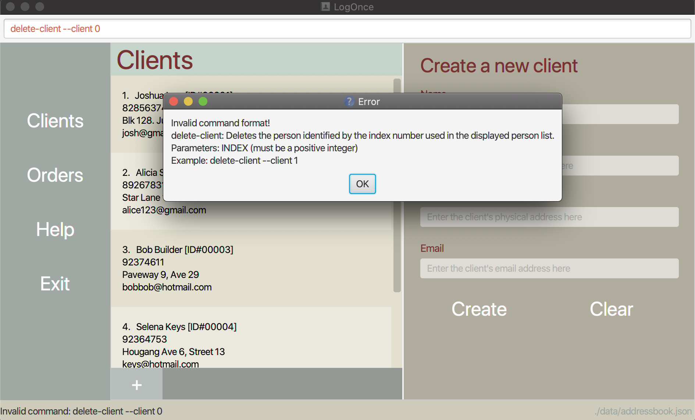
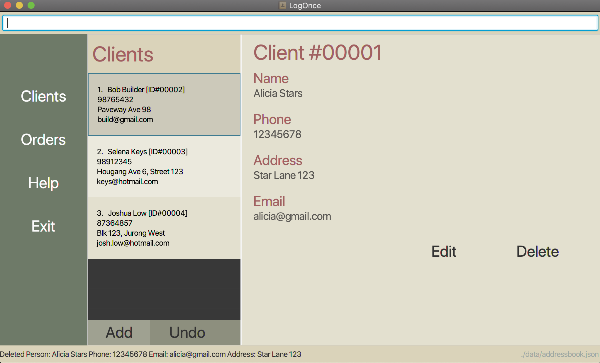
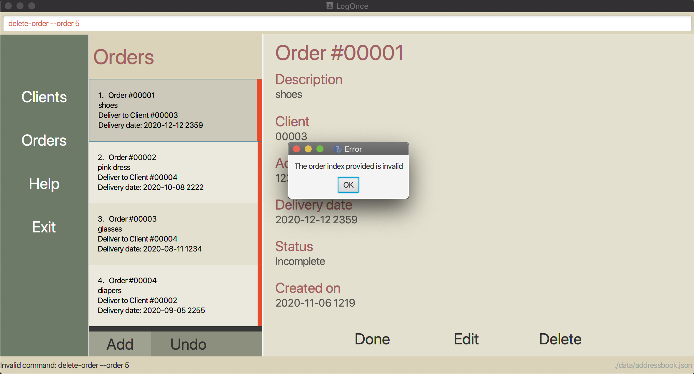
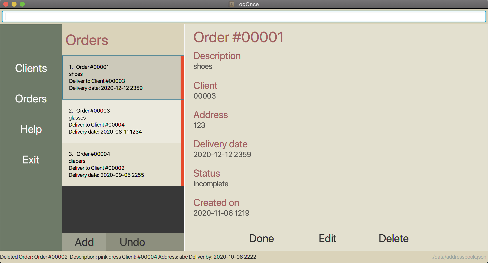

# LogOnce

**LogOnce** is a one-stop logistics tracker app for clerks to monitor shipping statuses of all clients and perform common logistics operations. It is optimized for use via a Command Line Interface (CLI) while still having the benefits of a Graphical User Interface (GUI). If you can type fast, LogOnce can get your tracking tasks done faster than traditional GUI apps. **This application is currently being developed and has not been deployed yet.**

* Table of Contents
{:toc}

--------------------------------------------------------------------------------------------------------------------

## Features

**:information_source: Notes about the command format:** 

* Words in angle brackets `<parameter>` are the parameters to be supplied by the user. 
  e.g. in `order --description <order description --client <client ID>`, `<client ID>` is a integer parameter such as `123`.

* Words with `--` before them indicate keywords that must be used unless otherwise specified. 
  e.g. `order --description Wooden Table --client 301`. `--description` and `--client` must be typed used.
  
* Words within `()` indicate optional keywords or tokens (most notably for `find` and `findorder`)

------------------------------------------------------------------------------------------------------------------------

### Adding an Order : `order`

**Description** : Creates an order made by a client. The order of the orders made by the client will be (by default) the natural ordering. 
Orders will be assigned an ID number automatically when created. This ID number is not unique and must be used in conjunction with the client ID to identify an order.

**Format** :  `order --description <order description> --client <client ID> --address <address> --date <date>` 

`<order description>` must exist in the order command

`<client id>` must exist in the order command (an order is always linked to a client)
`<address>` must exist in the order command (describes the address that the order will be sent to)
`<date>` must exist in the order command (describes the date the order must be delivered by) 

**Remark** : `<date>` must be in the format YYYY-MM-DD HHMM

`<address>` can be different from the client's own address

`<date of delivery>` must be in the format YYYY-MM-DD HHmm

**Example** : 
`order --description shoes --client 123 --address 22 college avenue drive --date 2020-10-31 2359` : creates an order ordered by client 123 called “shoes” that is to be delivered to "22 college avenue drive" by "2020-10-31 2359"

------------------------------------------------------------------------------------------------------------------------

### Adding a Client : `client`

**Description** : Creates a new client with the name `<client name>`, the address `<client address>`, the email `<client email>` and 
the phone number `<client phone number>`.

**Format** : `client --name <client name> --address <client address> --email <client email> --phone <client phone no.>`
  
`<client name>` must not be blank. 
`<client address>` must not be blank.  
`<client email>` must not be blank.  
`<client phone>` must not be blank.

**Example** : 
`client --name John Wick --address New York Continental --email johnwick@kgoomail.com --phone 91234567` : 
adds a client named John Wick whose address is the New York Continental, whose email is johnwick@kgoomail.com and 
whose phone number is 91234567.

------------------------------------------------------------------------------------------------------------------------

### Listing Orders : `list-order` 

**Description** : Returns a list of orders. The list will be sorted by the order ID that was assigned when the order was created.

**Format** : `list-order` 
Displays a list of all orders in the order list (and the client that placed the order respectively).

------------------------------------------------------------------------------------------------------------------------

### Listing Clients : `list-client`

**Description** : Returns a list of clients. The list will be sorted by the client ID that was assigned when the client was created.

**Format** : `list-client` 
Displays a list of all clients in the client list.

------------------------------------------------------------------------------------------------------------------------

### Undo Commands : `undo`

**Description** : Restores the address book to the state before the previous undoable command was executed.

**Format** : `undo` 
 
------------------------------------------------------------------------------------------------------------------------

### Deleting a Client : `delete-client`

**Description** : Deletes a client from client list.

**Format** : `delete-client --client <client index>`

Deletes client that has `<client index>` as its index in the client list. 

Note that `<client index>` is not the unique client id given to each client when added. 

`<client index>` is determined solely from the client list indexing, which **starts from `1`**.

`<client index>` must exist as a valid index in the client list, **starting from `1`**.

**Invalid Usage Example** :

Client index should be a valid index in the client list

**Valid Usage Example** :

`delete-client --client 1` : deletes the client with client index 1

------------------------------------------------------------------------------------------------------------------------

### Deleting an Order : `delete-order`

**Description** : Deletes an order from order list.

**Format** : `delete-order --order <order index>`

Deletes order that has `<order index>` as its index in the order list. 

Note that `<order index>` is not the unique order id given to each order when added. 

`<order index>` is determined solely from the order list indexing, which **starts from `1`**.

`<order id>` must exist as a valid index in the order list, **starting from `1`**.

**Invalid Usage Example** :

Order index should be a valid index in the order list

**Valid Usage Example** :

`delete-order --order 2` : deletes the order with order index 2

------------------------------------------------------------------------------------------------------------------------

### Completing Orders : `done`

**Description** : Marks a certain order as done.

**Format** : `done <order id>`

Marks `Order` with `<order id>` as done.

`<order id>` must exist in the order list.
`<order id>` is a unique number assigned to each order.

**Example** : 
`done 3` : deletes the order with an order ID of 3 (#00003 as represented in the GUI).

### Finding clients : `find`

**Description** : Finds clients by their name and optionally by their phone number, email address and residential address.

**Format** : `find <name keywords> (--address <address keywords>) (--email <email address>) (--phone <phone number>)`

This command will return clients that match all the tokens provided. The matching criteria for each token
will be explained below.

If any of the optional tokens are present, `<name keywords>` may be left blank.

`<name keywords>` is any amount of keywords, each separated by a space. A client's whose name contains any of these
keywords will be considered a match. For example: `find alex chungus`. Both `Alex Rider` and `Big Chungus` will be
considered matches.

`<address keywords>` is any amount of keywords, each separated by a space. The matching of these keywords works the same
as it does for `<name keywords>`. For example: `find --address jurong clementi` will display clients that have their
address as `Jurong West`, `Jurong East`, `Clementi Avenue 6`, `Clementi Mall`.

`<email address>` is a string that should be a valid email address. The email address has to be an
 exact match for the client to be displayed. For example: `find --email doe@gmail.com`. 
 
`<phone number>` is a string of numbers only with a minimum length of 3. The phone number also has to be an exact match
for the client to be displayed. For example: `find --phone 99223344`.

More examples:
`find alice --phone 9123 --address changi` will display any clients with 'Alice' in their names, with a phone number of 
9123 and who live in Changi. This would be a very specific search, as phone numbers must be an exact match.

`find bob charles --address queenstown commonwealth` will display any clients with either 'Bob' or 'Charles' in their names who also
live in Queenstown or Commonwealth. This would be a more general search, as each client only has to match one keyword in
each category of searching.

### Finding orders : `findorder`

**Description** : Finds orders by their description and optionally by their attached client IDs, delivery addresses and delivery dates.
Very similar usage to `find`

**Format** : `findorder <description keywords> (--address <address keywords>) (--date <date>) (--client <client ID>)`

This command will return orders that match all the tokens provided. The matching criteria for each token
will be explained below.

If any of the optional tokens are present, `<description keywords>` may be left blank.

`<description keywords>` is any amount of keywords, each separated by a space. An order whose description contains any of these
keywords will be considered a match. For example: `findorder iphone` will display all orders involving iPhones.

`<address keywords>` is any amount of keywords, each separated by a space. Functions the same as it does in `find` except
for orders.

`<client ID>` is an integer that should be greater than 0. The ID has to be an exact match for the order to be displayed.
For example: `findorder --client 1` will show all orders that are related to the client with an ID of 1.
 
`<date>` is a string of numbers separated by dashes in the format of `YYYY-MM-DD`. The date entered has to be valid and an
exact match for the order to be displayed. For example: `findorder --date 2020-11-27` will display all orders to be
delivered on the 27th of November, 2020.

--------------------------------------------------------------------------------------------------------------------

## Command summary

Action | Format
--------|------------------
**Order** | `order --description <order description> --client <client ID> --address <address> --date <date>`
**Client** | `client --name <client name> --address <client address>`
**Delete** | `delete-order --order <order index>`   `delete-client --client <client index>`
**List** | `list-order`   `list-client`  
**Done** | `done --order <order id>`
**Find** | `find <name keywords> (--address <address keywords>) (--email <email address>) (--phone <phone number>)`
**FindOrder**| `findorder <description keywords> (--address <address keywords>) (--date <date>) (--client <client ID>)`
**Undo**| `undo`
