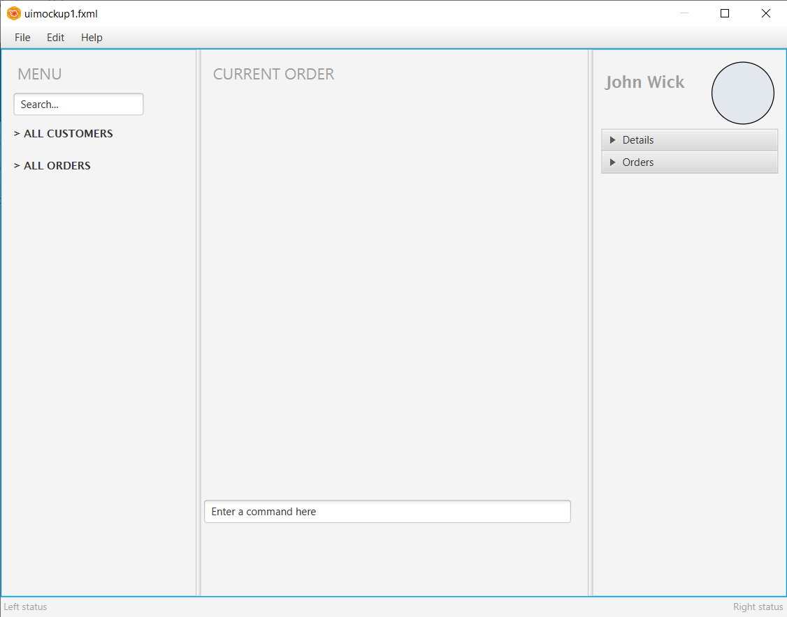

# LogOnce

## About

**LogOnce** is a one-stop logistics tracker app for clerks to monitor shipping statuses of all clients and perform common logistics operations. It is optimized for use via a Command Line Interface (CLI) while still having the benefits of a Graphical User Interface (GUI). If you can type fast, LogOnce can get your tracking tasks done faster than traditional GUI apps.

## Site Map

* [About Us](https://github.com/AY2021S1-CS2103-F09-4/tp/blob/master/docs/AboutUs.md)
* [User Guide](https://github.com/AY2021S1-CS2103-F09-4/tp/blob/master/docs/UserGuide.md)
* [Developer Guide](https://github.com/AY2021S1-CS2103-F09-4/tp/blob/master/docs/DeveloperGuide.md)

## Acknowledgements

* This project is based on the AddressBook-Level3 project created by the [SE-EDU initiative](https://se-education.org)
* Libraries used: [JavaFX](https://openjfx.io/), [Jackson](https://github.com/FasterXML/jackson), [JUnit5](https://github.com/junit-team/junit5)
